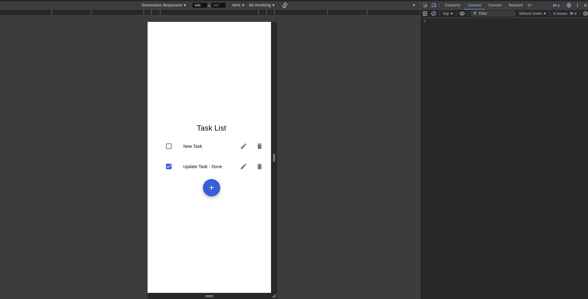
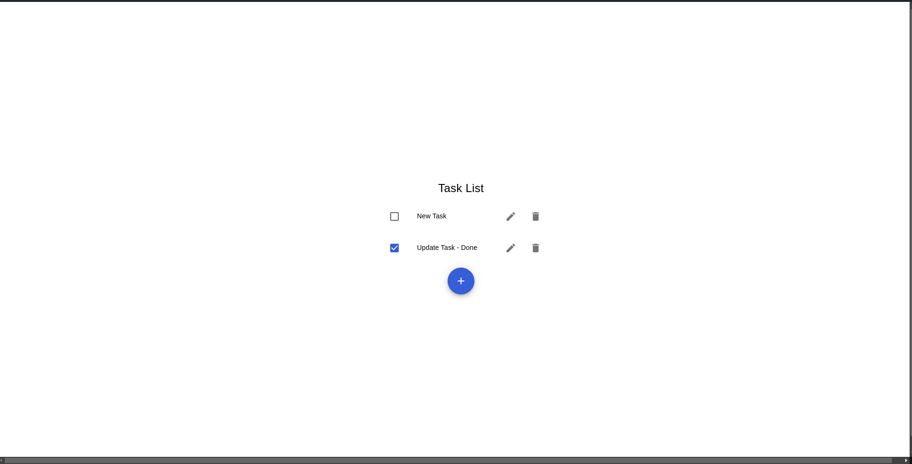
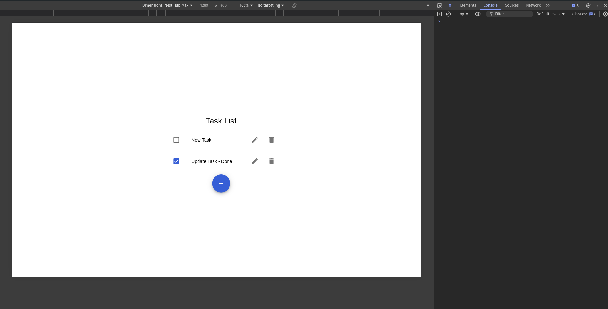

<h2>Lista de Tarefas</h2>

<h4>Objetivos:</h4>
<p> Criar uma interface de usuário simples que permita ao usuário adicionar, listar, editar,
completar e excluir tarefas (to-dos).</p>
<br />
<h4>Requisitos:</h4>

- [x] - Adicionar tarefas
- [x] - Listar tarefas
- [x] - Editar tarefas
- [x] - Completar tarefas
- [x] - Excluir tarefas

<h4>🛠️ Ferramentas utilizadas:</h4>

<p>React.JS para o Front-End</p>
<p>Material UI para interface dos componentes</p>
<p>JSON Web Server para criação do "banco de dados"</p>

<hr />

<h4>🚦 Rotas:</h4>

<p><strong>BaseUrl - DataBase: </strong>http://localhost:3000/tasks</p>
<p><strong>BaseUrl - Front-End: </strong> http://localhost:5173/</p>

```bash
  [taskId] - É gerado pela função UUID
  [GET] - Retorna todas as tarefas do banco de dados
  [POST] - Faz a criação das tarefas
  [DELETE] /{taskId} - Deleta uma tarefa por seu id
  [PATCH] /{taskID} - Rota usada para atualizar o estado de conclusão da tarefa e da descrição, utilizado o id da tarefa
```

<hr />

<h4>⚙️ Como usar a aplicação:</h4>

<p>Para fazer o setup da aplicação use { yarn }. Para fazer uso da interface digite  { yarn dev } no terminal. Já para iniciar o servidor use { yarn server } para que o banco de dados se inicie. Obs.: Usar na mesma pasta/diretorio do front-end.</p>

<hr />
<br />

<h4>Aplicação criada com intuito de ser responsiva - mobile first</h4>






